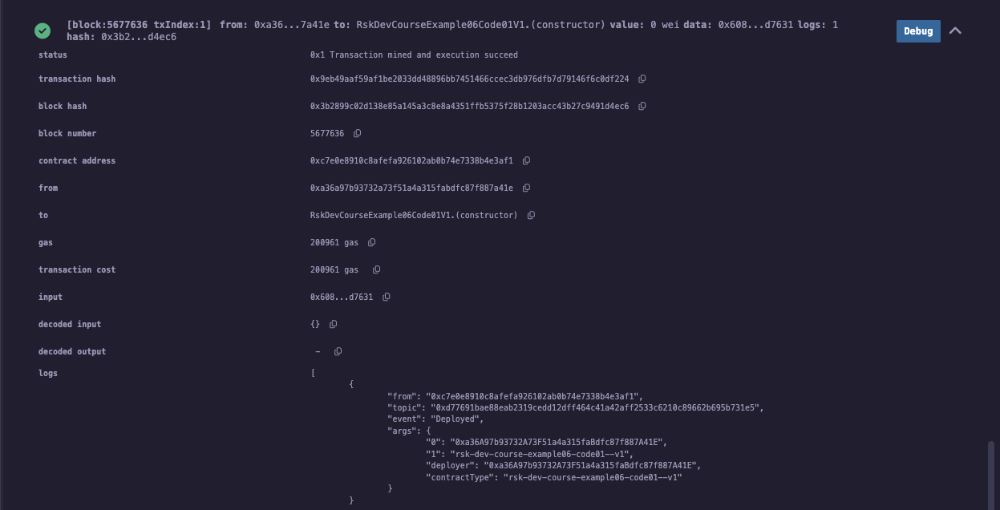
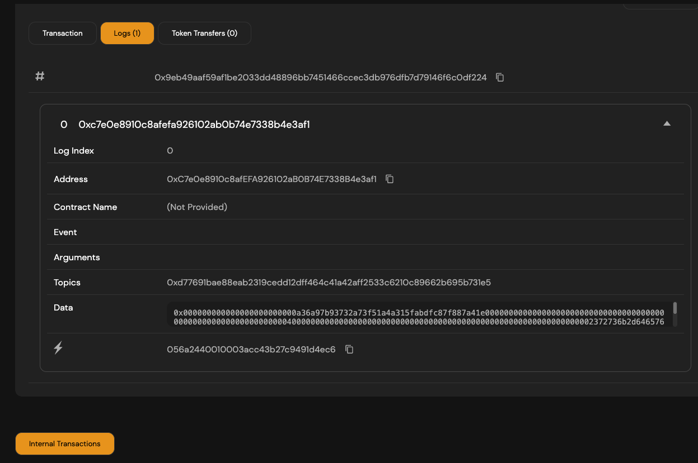

(1)
Smart contract deployed address on RSK Testnet

```
0xc7E0e8910c8aFeFA926102ab0b74E7338B4E3af1
```

(2)
Smart contract deployed bytecode

```
0x608060405234801561001057600080fd5b50336000806101000a81548173ffffffffffffffffffffffffffffffffffffffff021916908373ffffffffffffffffffffffffffffffffffffffff1602179055507fd77691bae88eab2319cedd12dff464c41a42aff2533c6210c89662b695b731e560008054906101000a900473ffffffffffffffffffffffffffffffffffffffff166040518060600160405280602381526020016103f5602391396040516100ba929190610198565b60405180910390a16101c8565b600073ffffffffffffffffffffffffffffffffffffffff82169050919050565b60006100f2826100c7565b9050919050565b610102816100e7565b82525050565b600081519050919050565b600082825260208201905092915050565b60005b83811015610142578082015181840152602081019050610127565b60008484015250505050565b6000601f19601f8301169050919050565b600061016a82610108565b6101748185610113565b9350610184818560208601610124565b61018d8161014e565b840191505092915050565b60006040820190506101ad60008301856100f9565b81810360208301526101bf818461015f565b90509392505050565b61021e806101d76000396000f3fe608060405234801561001057600080fd5b50600436106100365760003560e01c8063cb2ef6f71461003b578063d5f3948814610059575b600080fd5b610043610077565b6040516100509190610147565b60405180910390f35b610061610093565b60405161006e91906101aa565b60405180910390f35b6040518060600160405280602381526020016101c66023913981565b60008054906101000a900473ffffffffffffffffffffffffffffffffffffffff1681565b600081519050919050565b600082825260208201905092915050565b60005b838110156100f15780820151818401526020810190506100d6565b60008484015250505050565b6000601f19601f8301169050919050565b6000610119826100b7565b61012381856100c2565b93506101338185602086016100d3565b61013c816100fd565b840191505092915050565b60006020820190508181036000830152610161818461010e565b905092915050565b600073ffffffffffffffffffffffffffffffffffffffff82169050919050565b600061019482610169565b9050919050565b6101a481610189565b82525050565b60006020820190506101bf600083018461019b565b9291505056fe72736b2d6465762d636f757273652d6578616d706c6530362d636f646530312d2d7631a2646970667358221220b202486dc3a29f1e13a102f844d73e6dedce042e315006713aab5c053c4bc4f264736f6c634300081a003372736b2d6465762d636f757273652d6578616d706c6530362d636f646530312d2d7631
```

(3)
Smart contract deployment transaction hash on RSK Testnet

```
0x9eb49aaf59af1be2033dd48896bb7451466ccec3db976dfb7d79146f6c0df224
````

(4)
Smart contract deployment transaction data

```
0x000000000000000000000000a36a97b93732a73f51a4a315fabdfc87f887a41e0000000000000000000000000000000000000000000000000000000000000040000000000000000000000000000000000000000000000000000000000000002372736b2d6465762d636f757273652d6578616d706c6530362d636f646530312d2d76310000000000000000000000000000000000000000000000000000000000
````

(5)
Screenshot of Remix showing successful deployment



(6)
Screenshot of RSK Testnet Explorer, of the "Code" tab of the deployed smart contract


