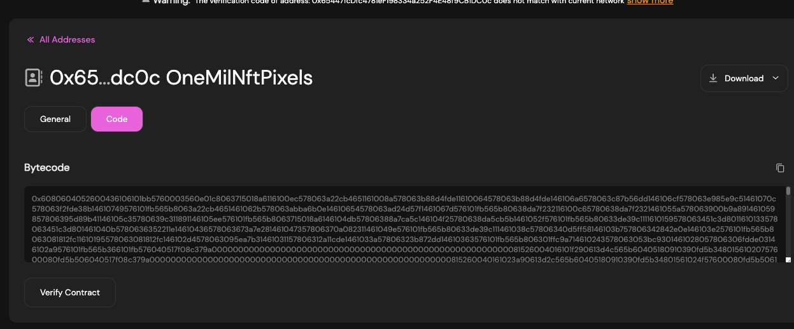

(1)
Smart contract deployed addresses on RSK Testnet (all)

```text
YOUR_ANSWER
YOUR_ANSWER
YOUR_ANSWER
```

(2)
Screenshot of RSK Testnet Explorer, of the "Code" tab of the deployed smart contract (`OneMilNftPixels` only).


